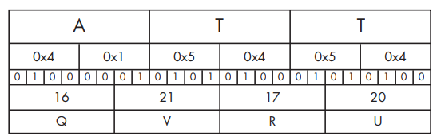

# Base 64 encode/decoder

Encode/decode any base64 string with an arbitrary scheme.

## Scheme

The scheme must be of 64 characters, example scheme:

```python
scheme = 'aABCDEFGHIJKLMNOPQRSTUVWXYZbcdefghijklmnopqrstuvwxyz0123456789+/' # index switched ('a')
```

## Encoding

To encode a string, run the following:

```python
import base64_encode as encoder
import logging

scheme = 'aABCDEFGHIJKLMNOPQRSTUVWXYZbcdefghijklmnopqrstuvwxyz0123456789+/' # index switched ('a')

encoder.encode("foobar", scheme, logging.INFO)

# Out:
# INFO:root:Encoder: Pre-encoded 'foobar' encoded to 'Ym9vXmEy'
```

## Decoding


To decode a string, run the following:

```python
import base64_decode as decoder
import logging

scheme = 'aABCDEFGHIJKLMNOPQRSTUVWXYZbcdefghijklmnopqrstuvwxyz0123456789+/' # index switched ('a')

encoder.decode("Ym9vXmEy", scheme, logging.INFO)

# Out:
# Pre-decoded 'Ym9vXmEy' decoded to 'foobar'
```

## Tests

Run `tests.py` for verification and usage purposes. 

## Background: Transforming data to base64

*Practical Malware Analysis*, by Michael Sikorski and Andrew Honig (2012)

The process of translating raw data to Base64 is fairly standard. It uses 24-bit
(3-byte) chunks. The first character is placed in the most significant position,
the second in the middle 8 bits, and the third in the least significant 8 bits.
Next, bits are read in blocks of six, starting with the most significant. The
number represented by the 6 bits is used as an index into a 64-byte long string
with each of the allowed bytes in the Base64 scheme. Figure 13-4 shows how the
transformation happens. The top line is the original string (ATT). The second
line is the hex representation of ATT at the nibble level (a nibble is 4 bits).
The middle line shows the actual bits used to represent ATT. The fourth line is
the value of the bits in each particular 6-bit-long section as a decimal number.
Finally, the last string is the character used to represent the decimal number
via the index into a reference string.



The letter A corresponds to the bits 01000001. The first 6 bits of the letter A
(010000) are converted into a single Base64-encoded letter Q. The last two bits
of the A (01) and the first four bits of the letter T (0101) are converted into
the second Base64-encoded character, V (010101), and so on. Decoding from Base64
to raw data follows the same process but in reverse. Each Base64 character is
transformed to 6 bits, and all of the bits are placed in sequence. The bits are
then read in groups of eight, with each group of eight defining the byte of raw
data.

In order to find the Base64 function in the malware, we can look for the 64-byte
long string typically used to implement the algorithm. The most commonly used
string adheres to the MIME Base64 standard. Here it is:

```md
ABCDEFGHIJKLMNOPQRSTUVWXYZabcdefghijklmnopqrstuvwxyz0123456789+/
```

Because an implementation of Base64 typically uses indexing strings, code that
contains Base64 encoding will often have this telltale string of 64 characters.
The Base64-indexing string is typically composed of printable characters (or it
would defeat the intent of the algorithm), and can therefore be easily eyeballed
in string output. A secondary piece of evidence that can be used to confirm the
use of a Base64-encoding algorithm is the existence of a lone padding character
(typically =) hard-coded into the function that performs the encoding.

One of the beautiful things about Base64 (at least from a malware author’s point
of view) is how easy it is to develop a custom substitution cipher. The only
item that needs to be changed is the indexing string, and it will have all the
same desirable characteristics as the standard Base64. As long as the string has
64 unique characters, it will work to create a custom substitution cipher. One
simple way to create a new indexing string is to relocate some of the characters
to the front of the string. For example, the following string was created by
moving the a character to the front of the string:

```md
aABCDEFGHIJKLMNOPQRSTUVWXYZbcdefghijklmnopqrstuvwxyz0123456789+/
```

When this string is used with the Base64 algorithm, it essentially creates a new
key for the encoded string, which is difficult to decode without knowledge of
this string. Malware uses this technique to make its output appear to be Base64,
even though it cannot be decoded using the common Base64 functions